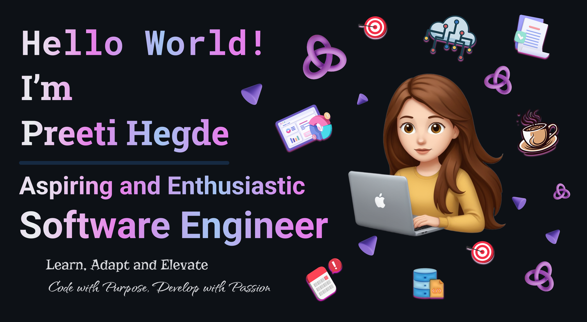

  

<h2 align="center">Hi, I’m Preeti Hegde 👩🏻‍💻</h2>

  Backend Java Engineer • AI/ML Enthusiast • Building reliable services & smart data products

  
  
  

---

### 🚀 What I’m focused on
- **Java × Spring Boot** microservices with clean architecture & observability  
- **LLMs** and practical ML integrations (RAG on AWS, model-serving)  
- **Anomaly detection** & computer vision for industrial use-cases (PatchCore, ResNet18)

### 🧰 Tech Stack
**Backend:** Java, Spring Boot, REST, Spring Batch, Kafka, Maven, MySQL, PostgreSQL  
**ML/AI:** Python, PyTorch, TensorFlow, scikit-learn, OpenCV, PatchCore, ResNet18  
**Cloud/DevOps:** AWS (ECS/EKS), Docker, CI/CD, GitHub Actions  
**Protocols & Data:** JSON, XML, SOAP • BPMN (Flowable)  
**Tools:** Git, Jira, Confluence, Bitbucket, Bamboo, Tableau, Excel

### 💡 Experience highlights
- Kept a Spring Boot microservice at **99.9% uptime** and reduced downtime by **25%**, improving stability across teams.  
- Helped releases ship **30% faster** via sprint planning, code reviews, and CI improvements.  
- Integrated **Stripe** webhooks & reconciliation, cutting payment failures by **40%**.  
- Built schedulers & data pipelines (Spring Batch) to remove manual work and speed onboarding by **70%**.

### 🎓 Recent work
- **Master’s Thesis — Joint Image Classification & Anomaly Detection for Reusable Containers**  
  Multi-view feature sharing, PatchCore + ResNet-18, PyTorch, Docker.  
  → [Repo](https://github.com/preetihegde/Joint-Image-Classification-and-Anomaly-Detection-for-Efficient-Inspection-of-Reusable-Containers)

### 🧩 Featured Projects
- **Skeleton Time-Series Action Classification** → [Repo](https://github.com/preetihegde/Skeleton-Data)  
- **Q-learning in Blackjack** → [Repo](https://github.com/preetihegde/Blackjack)  
- **Sudoku Solver (DL)** → [Repo](https://github.com/preetihegde/Sudoku)  
- **Cloud Segmentation & Forecasting (collab)** → [Repo](https://github.com/tharun-kumar-22/Cloud-Segmentation-and-Forecasting)

### 📝 Publication
- *Feedback and Recommendation System using Natural Language Processing* → [PDF](https://sahe.in/jir/journal_management/production/plagiarism_files/VOL_01%20ISSUE%2002_3.pdf)

### 📈 GitHub at a glance

### 🌍 Languages
English (C1) · Deutsch (B2) · हिंदी / Hindi (fluent) · ಕನ್ನಡ / Kannada (native)

---

Open to: Working-student / Junior Backend (Java) · AI/ML-adjacent backend roles · Germany/Remote
